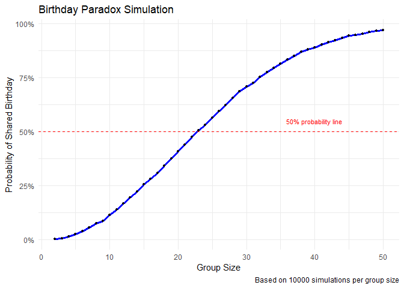
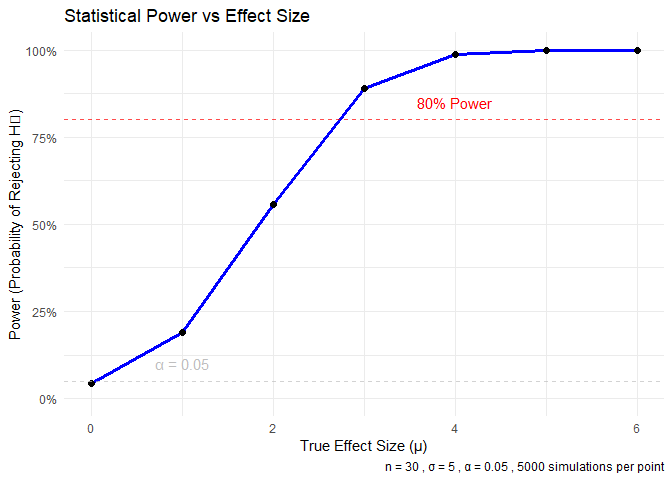
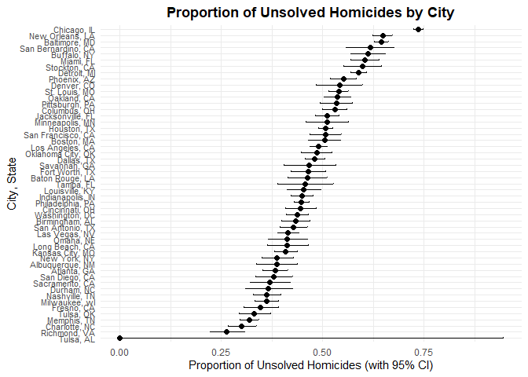

p8105_hw5_rd3228
================
Renxuan Deng
2025-11-10

# Problem 1

``` r
check_shared_birthday <- function(n) {
  birthdays <- sample(1:365, size = n, replace = TRUE)
  has_duplicate <- length(birthdays) != length(unique(birthdays))
  return(has_duplicate)
}
set.seed(123)

group_sizes <- 2:50
n_simulations <- 10000

results <- matrix(NA, nrow = n_simulations, ncol = length(group_sizes))

for (i in 1:length(group_sizes)) {
  n <- group_sizes[i]
  for (j in 1:n_simulations) {
    results[j, i] <- check_shared_birthday(n)
  }
}

probabilities <- colMeans(results)

sim_data <- data.frame(
  group_size = group_sizes,
  probability = probabilities
)

ggplot(sim_data, aes(x = group_size, y = probability)) +
  geom_line(color = "blue", size = 1.2) +
  geom_point(color = "black", size = 1) +
  labs(
    title = "Birthday Paradox Simulation",
    x = "Group Size",
    y = "Probability of Shared Birthday",
    caption = paste("Based on", n_simulations, "simulations per group size")
  ) +
  theme_minimal() +
  scale_y_continuous(labels = scales::percent) +
  geom_hline(yintercept = 0.5, linetype = "dashed", color = "red") +
  annotate("text", x = 40, y = 0.55, label = "50% probability line", 
           color = "red", size = 3)
```

    ## Warning: Using `size` aesthetic for lines was deprecated in ggplot2 3.4.0.
    ## ℹ Please use `linewidth` instead.
    ## This warning is displayed once every 8 hours.
    ## Call `lifecycle::last_lifecycle_warnings()` to see where this warning was
    ## generated.

<!-- -->

The probability grows surprisingly quickly as group size increases. The
probability that two person share a birthday reaches 50% when the group
size just over 20, and when the group size is 50, this probability is
nearly 100%.

# Problem 2

``` r
n <- 30
sigma <- 5
alpha <- 0.05
n_sim <- 5000
mu_values <- c(0, 1, 2, 3, 4, 5, 6)

run_simulation <- function(mu, n, sigma, n_sim) {
  results <- data.frame(
    mu_hat = numeric(n_sim),
    p_value = numeric(n_sim)
  )
  
  for (i in 1:n_sim) {
    x <- rnorm(n, mean = mu, sd = sigma)
    test_result <- t.test(x, mu = 0)
    tidy_result <- tidy(test_result)
    
    results$mu_hat[i] <- tidy_result$estimate
    results$p_value[i] <- tidy_result$p.value
  }
  
  return(results)
}

set.seed(123)

all_results <- list()

for (mu in mu_values) {
  cat("Running simulations for μ =", mu, "\n")
  all_results[[as.character(mu)]] <- run_simulation(mu, n, sigma, n_sim)
}
```

    ## Running simulations for μ = 0 
    ## Running simulations for μ = 1 
    ## Running simulations for μ = 2 
    ## Running simulations for μ = 3 
    ## Running simulations for μ = 4 
    ## Running simulations for μ = 5 
    ## Running simulations for μ = 6

``` r
power_results <- data.frame(
  mu = mu_values,
  power = numeric(length(mu_values)),
  avg_mu_hat = numeric(length(mu_values)),
  avg_mu_hat_rejected = numeric(length(mu_values))
)

for (i in 1:length(mu_values)) {
  mu <- mu_values[i]
  results <- all_results[[as.character(mu)]]
  
  power_results$power[i] <- mean(results$p_value < alpha)
  
  power_results$avg_mu_hat[i] <- mean(results$mu_hat)
  
  rejected <- results[results$p_value < alpha, ]
  if (nrow(rejected) > 0) {
    power_results$avg_mu_hat_rejected[i] <- mean(rejected$mu_hat)
  } else {
    power_results$avg_mu_hat_rejected[i] <- NA
  }
}

print(power_results)
```

    ##   mu  power avg_mu_hat avg_mu_hat_rejected
    ## 1  0 0.0446 0.00900112            0.146816
    ## 2  1 0.1906 1.00965124            2.232968
    ## 3  2 0.5564 1.99168819            2.604367
    ## 4  3 0.8902 3.00976197            3.195464
    ## 5  4 0.9872 3.97913690            4.010007
    ## 6  5 0.9994 4.98439553            4.986149
    ## 7  6 1.0000 5.98617606            5.986176

``` r
ggplot(power_results, aes(x = mu, y = power)) +
  geom_line(color = "blue", size = 1.2) +
  geom_point(color = "black", size = 2) +
  labs(
    title = "Statistical Power vs Effect Size",
    x = "True Effect Size (μ)",
    y = "Power (Probability of Rejecting H₀)",
    caption = paste("n =", n, ", σ =", sigma, ", α =", alpha, ",", n_sim, "simulations per point")
  ) +
  theme_minimal() +
  scale_y_continuous(limits = c(0, 1), labels = scales::percent) +
  geom_hline(yintercept = 0.8, linetype = "dashed", color = "red", alpha = 0.7) +
  annotate("text", x = 4, y = 0.85, label = "80% Power", color = "red") +
  geom_hline(yintercept = alpha, linetype = "dashed", color = "gray", alpha = 0.7) +
  annotate("text", x = 1, y = 0.1, label = paste("α =", alpha), color = "gray")
```

<!-- -->

``` r
estimate_data <- data.frame(
  mu = rep(power_results$mu, 2),
  estimate = c(power_results$avg_mu_hat, power_results$avg_mu_hat_rejected),
  type = rep(c("All Samples", "Only When H₀ Rejected"), each = nrow(power_results))
)

estimate_data <- estimate_data[!is.na(estimate_data$estimate), ]

ggplot(estimate_data, aes(x = mu, y = estimate, color = type, linetype = type)) +
  geom_line(size = 1.2) +
  geom_point(size = 2) +
  geom_abline(intercept = 0, slope = 1, color = "black", linetype = "dotted", alpha = 0.7) +
  labs(
    title = "Parameter Estimates vs True Effect Size",
    x = "True Effect Size (μ)",
    y = "Average Estimate (μ̂)",
    color = "Sample Type",
    linetype = "Sample Type",
    caption = paste("Reference line: y = x (perfect estimation)")
  ) +
  theme_minimal() +
  scale_color_manual(values = c("All Samples" = "steelblue", "Only When H₀ Rejected" = "darkred")) +
  scale_linetype_manual(values = c("All Samples" = "solid", "Only When H₀ Rejected" = "dashed"))
```

<!-- -->

## **Relationship between Effect Size and Power**

The first plot clearly shows that statistical power increases with
effect size. This demonstrates the fundamental relationship in
hypothesis testing: larger true effects are easier to detect with
statistical significance.

### Key observations:

When μ = 0 (null hypothesis is true), the rejection rate is
approximately 5%, which equals our α level

Power increases monotonically with effect size

The curve has a characteristic S-shape, with rapid increase in the
middle range of effect sizes

At μ = 6, power approaches 100%, meaning we almost always detect this
large effect

## **Properties of Parameter Estimates**

The second plot reveals an important phenomenon: the average estimate of
μ from statistically significant results is biased upward.

**Explanation:**

The black dotted line (y = x) represents unbiased estimation

The blue line (all samples) closely follows this line, showing that
overall, our estimates are unbiased

However, the red dashed line (only when H₀ is rejected) lies above the
true values for smaller effect sizes

This occurs because

1.  **Selection bias:** We’re only looking at results that passed the
    significance threshold

2.  **Random variation:** For small true effects, we need a relatively
    large positive sampling error to achieve statistical significance

3.  **Asymmetry:** For μ close to 0, negative sampling errors are less
    likely to produce significant results

4.  **Regression to the mean:** The bias decreases as the true effect
    size increases

# Problem 3

**Raw Data Description:**

uid: Unique identifier for each case (e.g., Alb-000001)

reported_date: Date the homicide was reported (YYYYMMDD)

victim_last: Victim’s last name

victim_first: Victim’s first name

victim_race: Victim’s race (e.g., White, Black, Hispanic, Asian, Other)

victim_age: Victim’s age (numeric or “Unknown”)

victim_sex: Victim’s gender (Male, Female, Unknown)

city: City where the homicide occurred

state: State (e.g., NM, GA, MD)

lat / lon: Geographic coordinates of the incident (some missing)

disposition: Case status (e.g., Closed by arrest, Open/No arrest, Closed
without arrest)

``` r
homicide_data <- read_csv("./homicide-data.csv")
```

    ## Rows: 52179 Columns: 12
    ## ── Column specification ────────────────────────────────────────────────────────
    ## Delimiter: ","
    ## chr (9): uid, victim_last, victim_first, victim_race, victim_age, victim_sex...
    ## dbl (3): reported_date, lat, lon
    ## 
    ## ℹ Use `spec()` to retrieve the full column specification for this data.
    ## ℹ Specify the column types or set `show_col_types = FALSE` to quiet this message.

``` r
homicide_summary <- homicide_data |>
  mutate(city_state = paste(city, state, sep = ", ")) |>
  group_by(city_state) |>
  summarize(
    total_homicides = n(),
    unsolved_homicides = sum(disposition %in% c("Closed without arrest", "Open/No arrest"))
  ) |>
  arrange(desc(unsolved_homicides))

head(homicide_summary) |> kable()
```

| city_state       | total_homicides | unsolved_homicides |
|:-----------------|----------------:|-------------------:|
| Chicago, IL      |            5535 |               4073 |
| Baltimore, MD    |            2827 |               1825 |
| Houston, TX      |            2942 |               1493 |
| Detroit, MI      |            2519 |               1482 |
| Philadelphia, PA |            3037 |               1360 |
| Los Angeles, CA  |            2257 |               1106 |

``` r
baltimore_data <- homicide_summary |>
  filter(city_state == "Baltimore, MD")

baltimore_test <- prop.test(
  x = baltimore_data$unsolved_homicides,
  n = baltimore_data$total_homicides
)

baltimore_tidy <- baltimore_test |>
  tidy() |>
  select(estimate, conf.low, conf.high)

baltimore_tidy |> kable()
```

|  estimate |  conf.low | conf.high |
|----------:|----------:|----------:|
| 0.6455607 | 0.6275625 | 0.6631599 |

``` r
all_cities_test <- homicide_summary |>
  mutate(
    test_results = map2(unsolved_homicides, total_homicides, 
                       \(x, y) prop.test(x = x, n = y)),
    tidy_results = map(test_results, tidy)
  ) |>
  unnest(tidy_results) |>
  select(city_state, total_homicides, unsolved_homicides, 
         estimate, conf.low, conf.high) |>
  arrange(estimate)
```

    ## Warning: There was 1 warning in `mutate()`.
    ## ℹ In argument: `test_results = map2(...)`.
    ## Caused by warning in `prop.test()`:
    ## ! Chi-squared approximation may be incorrect

``` r
head(all_cities_test) |> kable()
```

| city_state | total_homicides | unsolved_homicides | estimate | conf.low | conf.high |
|:---|---:|---:|---:|---:|---:|
| Tulsa, AL | 1 | 0 | 0.0000000 | 0.0000000 | 0.9453792 |
| Richmond, VA | 429 | 113 | 0.2634033 | 0.2228571 | 0.3082658 |
| Charlotte, NC | 687 | 206 | 0.2998544 | 0.2660820 | 0.3358999 |
| Memphis, TN | 1514 | 483 | 0.3190225 | 0.2957047 | 0.3432691 |
| Tulsa, OK | 583 | 193 | 0.3310463 | 0.2932349 | 0.3711192 |
| Fresno, CA | 487 | 169 | 0.3470226 | 0.3051013 | 0.3913963 |

``` r
all_cities_test |>
  ggplot(aes(x = estimate, y = reorder(city_state, estimate))) +
  geom_point(size = 2) +
  geom_errorbarh(aes(xmin = conf.low, xmax = conf.high), height = 0.2) +
  labs(
    title = "Proportion of Unsolved Homicides by City",
    x = "Proportion of Unsolved Homicides (with 95% CI)",
    y = "City, State"
  ) +
  theme_minimal() +
  theme(
    plot.title = element_text(hjust = 0.5, face = "bold"),
    axis.text.y = element_text(size = 8)
  )
```

<!-- -->
